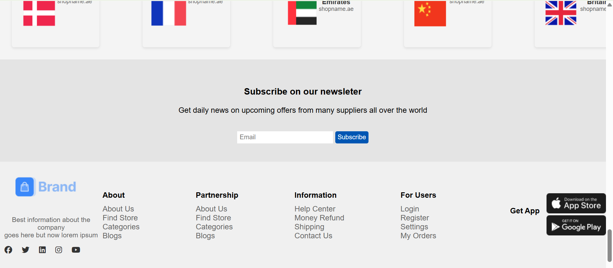

  

<h1 align="center">🛒 Sleek & Responsive eCommerce Frontend</h1>

  A fully responsive, interactive, and visually polished eCommerce UI built with <b>HTML, CSS, and JavaScript</b>. 
  Featuring 🔐 Authentication, 🛒 Cart System, ❤️ Wishlist, 🌙 Dark Mode, 🔎 Live Filters, and ⚡ Performance Boosts — all wrapped in a modern, user-first design.

  
  
  
  
  

---

 <h2 align="center">📚 Table of Contents</h2> 

- [🚀 Live Demo & Figma](#-live-demo--figma)
- [🎯 Features](#-features)
- [🛠️ Tech Stack](#️-tech-stack)
- [📁 Project Structure](#-project-structure)
- [📸 Screenshots](#-screenshots)
- [⚙️ Setup & Installation](#️-setup--installation)
- 🔍 [Feature Breakdown](#-feature-breakdown)
- [🚀 Performance Boosts](#-performance-boosts)
- 🤝 [Contact & Contribution](#-contact--contribution)
- 📜 [License](#-license)

---

 <h2 align="center">🚀 Live Demo & Figma</h2> 

  
  

---
 <h2 align="center">🎯 Features</h2> 

<ul align="center">
  <li>🔐 <strong>User Authentication</strong>: Secure signup, login & logout with data persistence in LocalStorage</li>
  <li>🛒 <strong>Shopping Cart</strong>: Add/remove items, adjust quantities & see real-time price updates</li>
  <li>👤 <strong>User Dashboard</strong>: View/update profile, shipping details & order history</li>
  <li>❤️ <strong>Wishlist</strong>: Save and revisit your favorite products effortlessly</li>
  <li>🔎 <strong>Search & Live Filters</strong>: Instantly filter by category, price range & rating; includes live keyword search</li>
  <li>🌙 <strong>Dark Mode</strong>: Toggle light/dark themes with user preference saved across sessions</li>
  <li>📱 <strong>Responsive Design</strong>: Optimized layouts for desktop, tablet & mobile screens</li>
  <li>📦 <strong>API Integration</strong>: Fetch and display the latest 5 orders via JSONPlaceholder for realistic demo data</li>
</ul>

---

 <h2 align="center">🛠️ Tech Stack</h2> 

<table align="center">
  <thead>
    <tr>
      <th style="padding: 8px 16px;">🚀 Technology</th>
      <th style="padding: 8px 16px;">💡 Purpose</th>
    </tr>
  </thead>
  <tbody>
    <tr>
      <td><strong>HTML5</strong></td>
      <td>Semantic structure and layout of the application</td>
    </tr>
    <tr>
      <td><strong>CSS3</strong></td>
      <td>Responsive design, custom styling, animations, and dark mode</td>
    </tr>
    <tr>
      <td><strong>JavaScript (ES6)</strong></td>
      <td>Handles interactivity, cart logic, filtering, and authentication</td>
    </tr>
    <tr>
      <td><strong>LocalStorage</strong></td>
      <td>Persists user session, cart data, and theme preference</td>
    </tr>
    <tr>
      <td><strong>Fetch API</strong></td>
      <td>Fetches order history and external resources asynchronously</td>
    </tr>
    <tr>
      <td><strong>JSONPlaceholder</strong></td>
      <td>Fake backend to simulate user order history and API calls</td>
    </tr>
  </tbody>
</table>

---

 <h2 align="center">📁 Project Structure</h2> 

---
## 📸 Screenshots

| 🏠 Main Page | 🛒 My Cart |
|-------------|------------|
|  |  |

| 🧱 Product Grid | 📦 Grid View |
|----------------|--------------|
|  |  |

| 🔐 Login Page | 📥 Footer |
|--------------|-----------|
|  |  |

---

 <h2 align="center">⚙️ Setup & Installation</h2> 

<h4  align="center">1️⃣ Open Locally</h4>
Just open `index.html` in your browser — no setup needed!

<h4 align="center">2️⃣ Using Live Server (optional)</h4>
If you're using VS Code:
- Right-click `index.html` → _Open with Live Server_

---

 <h2 align="center">🔍 Feature Breakdown</h2> 

<table align="center">
  <tr>
    <td  align="center"><h4>🔐 Authentication</h4></td>
    <td>
      
      <ul>
        <li>User Signup, Login, and Logout stored in <code>LocalStorage</code></li>
        <li>Protects sensitive pages like Dashboard</li>
      </ul>
    </td>
  </tr>
  <tr>
    <td><h4>🛒 Cart System</h4></td>
    <td>
      
      <ul>
        <li>Add, remove, and update product quantities</li>
        <li>Real-time total price updates</li>
        <li>Cart data persisted via <code>LocalStorage</code></li>
      </ul>
    </td>
  </tr>
  <tr>
    <td><h4>📦 Order History</h4></td>
    <td>
      
      <ul>
        <li>Simulates real orders using <a href="https://jsonplaceholder.typicode.com/">JSONPlaceholder</a></li>
        <li>Dynamically fetches and displays the latest 5 orders</li>
      </ul>
    </td>
  </tr>
  <tr>
    <td><h4>🌙 Dark Mode</h4></td>
    <td>
      
      <ul>
        <li>Toggle between Light and Dark themes</li>
        <li>Stores user preference in <code>LocalStorage</code></li>
      </ul>
    </td>
  </tr>
  <tr>
    <td><h4>🔍 Filters + Search</h4></td>
    <td>
      
      <ul>
        <li>Live filtering by category, price range, and rating</li>
        <li>Instant keyword search with real-time results</li>
      </ul>
    </td>
  </tr>
</table>

---

 <h2 align="center">🚀 Performance Boosts</h2> 

<ul align="center">
  <li>
    
    <strong> Lazy-loading images</strong> to improve initial page speed and reduce load time
  </li>
  <li>
    
    <strong> Minified CSS & JS</strong> for smaller bundle sizes and faster rendering
  </li>
  <li>
    
    <strong> CDN Delivery</strong> of fonts & libraries to enhance availability and performance
  </li>
  <li>
    
    <strong> Fully Responsive Design</strong> for seamless experience across all screen sizes
  </li>
</ul>

<h2 align="center">🤝 Contact & Contribution</h2>

  
  &nbsp;
  

  
  &nbsp;
  

  <i>Have feedback, want to collaborate, or just say hello?</i> 
  <strong>Let’s connect and build something amazing together!</strong>

---

 <h2 align="center">📜 License</h2> 

  
  
  

  This project is licensed under the <strong>MIT License</strong> — free to use, modify, and distribute.
   
  <strong>📦 Project Status:</strong> Completed and ready for portfolio showcase

 

  
  
  

<strong>Crafted with clarity, creativity & care 🎨</strong>

  
  &nbsp;•&nbsp;
  
  &nbsp;•&nbsp;
  
   
  

  <i>Designed for real-world impact — user-first, mobile-ready, and fully customizable.</i>

